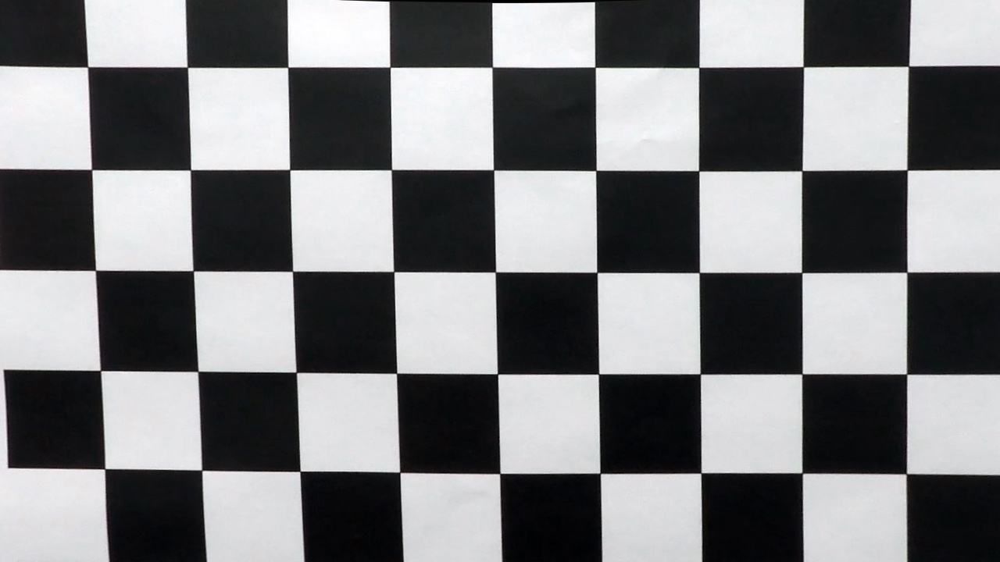
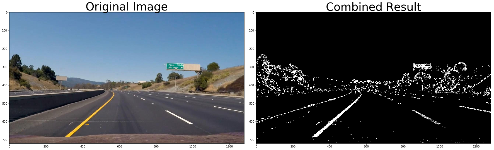
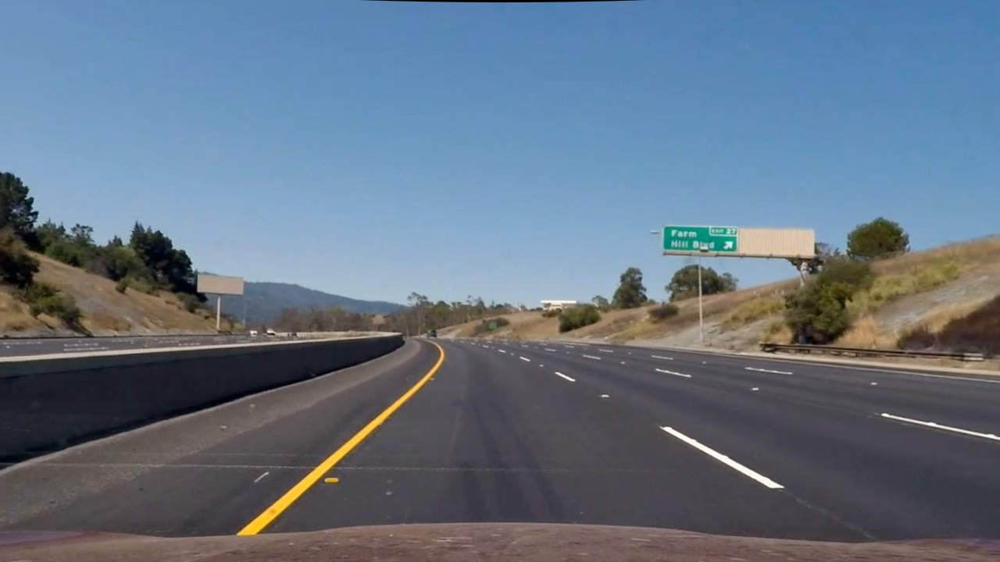
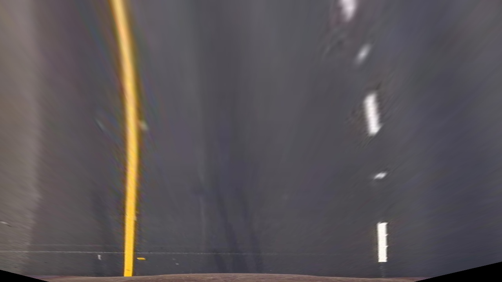
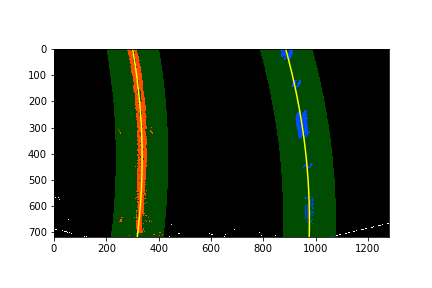
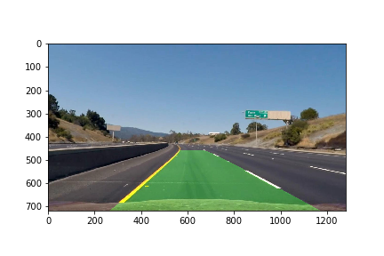

##Writeup Template
###You can use this file as a template for your writeup if you want to submit it as a markdown file, but feel free to use some other method and submit a pdf if you prefer.

---

**Advanced Lane Finding Project**

The goals / steps of this project are the following:

* Compute the camera calibration matrix and distortion coefficients given a set of chessboard images.
* Apply a distortion correction to raw images.
* Use color transforms, gradients, etc., to create a thresholded binary image.
* Apply a perspective transform to rectify binary image ("birds-eye view").
* Detect lane pixels and fit to find the lane boundary.
* Determine the curvature of the lane and vehicle position with respect to center.
* Warp the detected lane boundaries back onto the original image.
* Output visual display of the lane boundaries and numerical estimation of lane curvature and vehicle position.

[//]: # (Image References)

[image1]: ./examples/undistort_output.png "Undistorted"
[image2]: ./test_images/test1.jpg "Road Transformed"
[image3]: ./examples/binary_combo_example.jpg "Binary Example"
[image4]: ./examples/warped_straight_lines.jpg "Warp Example"
[image5]: ./examples/color_fit_lines.jpg "Fit Visual"
[image6]: ./examples/example_output.jpg "Output"
[video1]: ./project_video.mp4 "Video"

## [Rubric](https://review.udacity.com/#!/rubrics/571/view) Points
###Here I will consider the rubric points individually and describe how I addressed each point in my implementation.  

---
###Writeup / README

####1. Provide a Writeup / README that includes all the rubric points and how you addressed each one.  You can submit your writeup as markdown or pdf.  [Here](https://github.com/udacity/CarND-Advanced-Lane-Lines/blob/master/writeup_template.md) is a template writeup for this project you can use as a guide and a starting point.  

You're reading it!
###Camera Calibration

####1. Briefly state how you computed the camera matrix and distortion coefficients. Provide an example of a distortion corrected calibration image.

The code for this step is contained in the first code cell of the IPython notebook located in lines 2 through 6 of the file called `ALFP.py`.  

The first step is to setup the arrays for object points and image points.  Object poinst array 'objpoints' contain the coordinates (x, y, z) of the chesboard corners in the world, z is 0 and x, y are the coordinates of the corners. A function is created to pass an image and 'objp' array is first created afterwhich the image is converted to gray scale.  The gray image is passed through OpenCV's findChesboardCorder which returns corner coordinates.  The coordinates are then passed to the imgpoints array and the ojbp are appended to objpoints.  

With the arrays popoulated, they are used to compute the camera calibration and distortion coefficients.  The distortion correction is applied to the distorted image. 


###Pipeline (single images)

####1. Provide an example of a distortion-corrected image.
To demonstrate this step, I will describe how I apply the distortion correction to one of the test images like this one:



####2. Describe how (and identify where in your code) you used color transforms, gradients or other methods to create a thresholded binary image.  Provide an example of a binary image result.
I used a combination of color and gradient thresholds to generate a binary image (thresholding steps at lines 11 through 14 in `ALFP.py`).  Here's an example of my output for this step.  (note: this is from  an extracted frame from the project video)




####3. Describe how (and identify where in your code) you performed a perspective transform and provide an example of a transformed image.

The code for my perspective transform includes a function called `warp()`, which appears in lines 15 through 16 in the file `ALFP.py`.  The `warp()` function takes as inputs an image (`img`), as well as source (`src`) and destination (`dst`) points.  I chose the hardcode the source and destination points in the following manner:

```
    # Four source coordinates
    src = np.float32(
        [[690, 460],
         [1180, 720],
         [570, 460],
         [280, 720]])
    
    # Four desired coordinates
    dst = np.float32(
        [[980, 0], 
         [980, 720], 
         [330, 0],
         [330, 720]])

```


I verified that my perspective transform was working as expected by drawing the `src` and `dst` points onto a test image and its warped counterpart to verify that the lines appear parallel in the warped image.  Additionally the inverse coordinates are computed and used to unwarp the birds eye view image




####4. Describe how (and identify where in your code) you identified lane-line pixels and fit their positions with a polynomial?

Then I did some other stuff and fit my lane lines with a 2nd order polynomial kinda like this:



The code can be found in cells 20 to 22. Using the birds eye view image, it is thresheld and the result is a binary image.  The binary image is then passed to the `sliding_window()` function.  This function takes a histogram of the bottom half of the binary image.  The peaks of the histogram are then used as the starting point for the sliding window thresholding. The output is the secord order polynomial for each of the lanes. 

The second order polynomial is then passed to the `continous_fit()` function.  The funtion returns the points of the lines and mask that will be applied to the next image.

####5. Describe how (and identify where in your code) you calculated the radius of curvature of the lane and the position of the vehicle with respect to center.

I did this in lines 24 in my code in `ALFP.py`.  The pixel calibration of the image is computed and applied to the calculation of the radii of the curvature of the fitted line points from `continous_fit()`. 

####6. Provide an example image of your result plotted back down onto the road such that the lane area is identified clearly.

I implemented this step in lines 26 through 27 in my code in `ALFP.py` in the function `drawing()`.  Here is an example of my result on a test image:



---

###Pipeline (video)

####1. Provide a link to your final video output.  Your pipeline should perform reasonably well on the entire project video (wobbly lines are ok but no catastrophic failures that would cause the car to drive off the road!).

Here's a [link to my video result](./white.mp4)

---

###Discussion

####1. Briefly discuss any problems / issues you faced in your implementation of this project.  Where will your pipeline likely fail?  What could you do to make it more robust?

Currently thresholding is still a major challenge.  I've tried different parameters but shadows and shading changes in the road such as different asphalt gradients causes the thresholding to saturate.  Addtional windowing and use of different filters can help reduce the noise.

